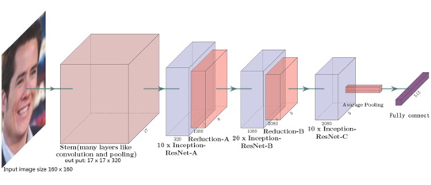

# Deepfake Detection using Transfer Learning

## 📌 Project Overview

This project was developed as a capstone for the **ZAKA AI Machine Learning Certification Program**, in collaboration with **Hiba Alkhorasani** and under the supervision of **Fouad Trad**.

Our goal was to build a robust deepfake detection system leveraging deep learning and transfer learning techniques. We explored various CNN-based models and advanced pre-trained architectures to classify images as real or fake.

---

## 🔍 Problem Statement

Deepfakes pose a significant threat to digital integrity, making it increasingly difficult to trust visual media. This project focuses on detecting manipulated facial images using deep learning approaches, especially transfer learning, to identify subtle inconsistencies and patterns left behind by synthetic generation.

---

## 🧠 Approach

We experimented with several models and techniques:

### 1. **Feature Extraction with CNNs**
- Built a custom convolutional neural network for initial feature extraction.
- Helped us understand the low-level facial features involved in classification.

### 2. **Transfer Learning**
We fine-tuned the following pre-trained models on our deepfake dataset:

- **EfficientNet**
- **ResNet**
- **FaceNet** (Best Performing)

FaceNet achieved the **highest accuracy**, effectively distinguishing real vs fake images due to its powerful facial embedding capability.

### 3. **Image Embedding Model**
- Implemented an image embedding pipeline using FaceNet.
- Used embeddings for clustering and improved classification.

---

## 📊 Results

| Model       | Accuracy |
|-------------|----------|
| CNN (Baseline) | 84.62%    |
| EfficientNet | 72.87%    |
| ResNet       | 70%    |
| **FaceNet**     | **~92%** |

> 📌 Note: Results are based on our validation set. Actual performance may vary depending on the dataset and preprocessing pipeline.

---

## 🗃️ Dataset

We used real and fake facial images obtained from Kaggle. We used a subset from the data; 16000 train, 800 validation, 4000 test images. Images were preprocessed to a fixed sized of 128 by 128 pixels.

---

